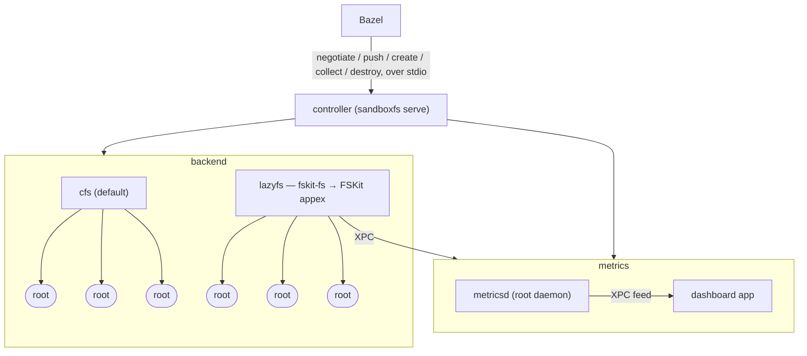

# sandboxfs

An attempt at a better sandbox implementation that does not use symlinks

> See Bazel issue: https://github.com/bazelbuild/bazel/issues/29165

## Architecture

**What comes from where**

- **Bazel → controller.** Bazel spawns `sandboxfs serve` per build and speaks
  varint length-delimited protobuf on stdin/stdout: `Negotiate` (one-time handshake
  carrying backend options), `Push` (fire-and-forget directory blobs + host
  locations), `Create` (an input-tree manifest → the path the action runs in),
  `Collect` (harvest declared outputs), `Destroy`.
- **Controller → backend.** The controller dispatches through the `Backend` trait.
  `cfs` (default) projects inputs as real isolated files — no symlinks; `lazyfs`
  (`fskit-fs`) routes to the FSKit appex. `cfs` itself is developed in its own
  repository: this workspace builds against the stand-in in `crates/cfs`, so an
  ordinary `cargo build` needs no access to it and yields a controller that serves
  `lazyfs` and reports the missing backend for `cfs`. `packaging/package.sh` points
  the dependency at the real crate for the duration of a release build.
- **Controller → metricsd.** On a metrics-opted-in `Negotiate`, `MetricsGate`
  brackets build windows with `begin`/`end` and periodically pushes the backend's
  cumulative `report_text` to the daemon. `metricsd` is a root LaunchDaemon that
  owns kdebug (syscall tracing scoped to the backend's path prefix) only while a
  window is open, and is otherwise inert.
- **metricsd → app.** The daemon is the central sink; the dashboard app tails it
  live over one XPC method, `feed(since=<cursor>)`, and derives all views
  (Gantt, create-rate, throughput) client-side.

**License**

MIT — see [LICENSE](LICENSE). The `cfs` backend is a separate, commercially
licensed product and is not part of this repository; `crates/cfs` here is an
MIT-licensed stand-in for it.
