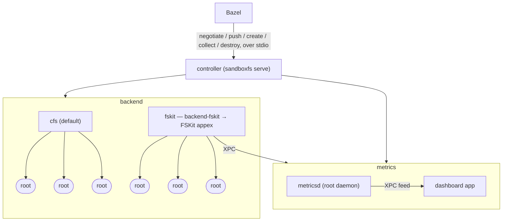

# sandboxfs

Alternative sandboxing strategies for Bazel.

> See Bazel issue: https://github.com/bazelbuild/bazel/issues/29165

## Architecture

```mermaid
flowchart TD
    Bazel["Bazel"]
    controller["controller (sandboxfs serve)"]

    subgraph metrics["metrics"]
        metricsd["metricsd (root daemon)"]
        app["dashboard app"]
        metricsd -->|XPC feed| app
    end

    subgraph backend["backend"]
        cfs["cfs (default)"]
        lazy["fskit — backend-fskit → FSKit appex"]
        cfsr1(["root"])
        cfsr2(["root"])
        cfsr3(["root"])
        lazyr1(["root"])
        lazyr2(["root"])
        lazyr3(["root"])
        cfs --> cfsr1 & cfsr2 & cfsr3
        lazy --> lazyr1 & lazyr2 & lazyr3
    end

    Bazel -->|"negotiate / push / create / collect / destroy, over stdio"| controller
    controller --> backend
    controller --> metrics
    lazy -->|XPC| metrics
```

**License**

MIT — see [LICENSE](LICENSE). 
